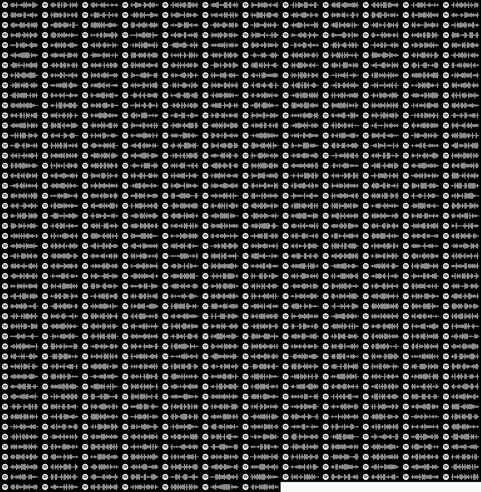

# SpotifyCodeCollageMaker
Small, but customisable programm that makes a collage with Spotify song codes.

## Setup
Create a `secrets.py` file in the project root with following constants: 
```
SPOTIFY_CLIENT_ID = "spotify_client_id"
SPOTIFY_CLIENT_SECRET = "spotify_client_secret"
```
Check credentials pair at [Spotify Developers](https://developer.spotify.com/) page.
You are ready to go!


## Usage
### Basic 
```
python3 main.py playlist_uri
```
`playlist_uri` - Spotify playlist URI or URL. Example: 
```
python3 main.py spotify:playlist:37i9dQZEVXbMDoHDwVN2tF
```


### Arguments
```
python3 main.py [-h] [--columns COLUMNS] [--show] [--size SIZE] [--shuffle] [--color_factory {ordered_colors,random_colors,single_color}] [--bar_color {white,black}] [--bg_color_hex BG_COLOR_HEX] playlist_uri
```
Example:
```
python3 main.py spotify:playlist:37i9dQZEVXbMDoHDwVN2tF --columns 5 --show --size 256 --shuffle --color_factory single_color --bar_color black --bg_color_hex fefefe
```

#### Mandatory:   
`playlist_uri` - Spotify URI or URL for source playlist

#### Optional:   
`-h`, `--help` - for help.  
`--columns COLUMNS` - number of columns (`1` default).  
`--show` - open final image when finished.    
`--size SIZE` - size(width) of individual track code (`128`, `256`, `512`, etc). (`256` default).  
`--shuffle` - shuffle tracks in the playlist.   
`--color_factory` - color choose strategy for individual code image. Supported values `ordered_colors`, `random_colors`, `single_color` (`random_colors` default). 
You can implement your own stratagy, checkout [color_factory.py](./color_factory.py) module.   
`--bar_color` - color of code image bars. Supported values `white`, `black` (`white` default).   
`--bg_color_hex BG_COLOR_HEX` - color of code image background in hex format (`000000` default).  

                        
                        
## Generated collages
By mixing arguments you can get diffrent results:  
<p align="center" gravity="center">
  
  
  
</p>


## Credits
Many thanks to [@Rickgrendel](https://github.com/Rickgrendel) for his [message](https://github.com/spotify/web-api/issues/519#issuecomment-618114678) 💪🔥❤️!   
If you have questions or need more information, welcome 
[](https://t.me/wiski_w) 
[](https://www.instagram.com/wiski_w/) 
[](https://www.fb.com/wisklwiskl) 